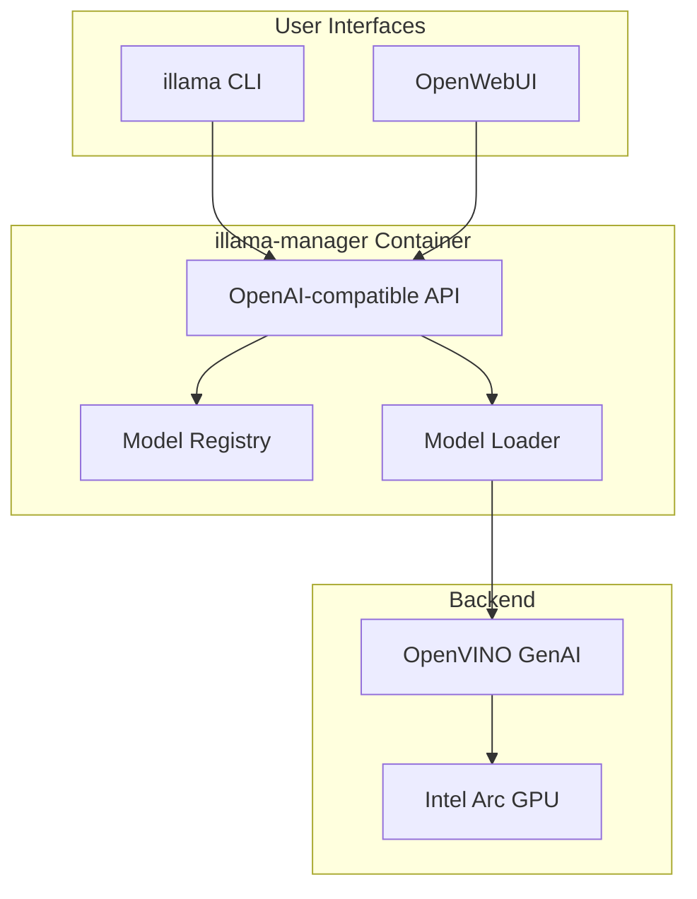
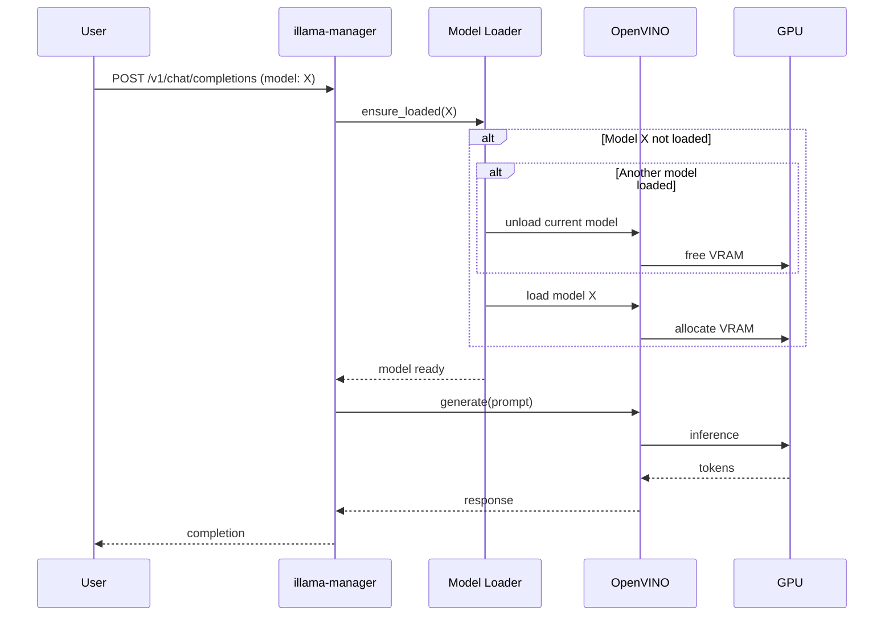

# illama Architecture

This document describes the architecture of illama, an Ollama-like LLM stack for Intel Arc GPUs using OpenVINO.

## Overview



## Components

### illama-manager

The core service that provides:

- **OpenAI-compatible API endpoints**:
  - `GET /v1/models` → list of available models in registry
  - `POST /v1/chat/completions` → chat with streaming support
  - `POST /v1/embeddings` → embedding generation (optional)

- **Single-model-at-a-time policy**:
  - Only one model loaded in GPU memory at any time
  - Automatic switching when a different model is requested
  - Reduces VRAM usage on consumer GPUs

- **Idle eviction**:
  - Configurable TTL (default: 600 seconds)
  - Automatically unloads model after inactivity
  - Frees GPU memory for other tasks

### illama CLI

Command-line interface matching Ollama's UX:

| Command | Description |
|---------|-------------|
| `illama pull <model>` | Download, convert, and register a model |
| `illama rm <model>` | Remove from registry and delete artifacts |
| `illama list` | List models in registry |
| `illama ps` | Show loaded model + runtime stats |
| `illama run <model> [prompt]` | Ensure model loaded, run prompt |
| `illama serve` | Run local development server |
| `illama doctor` | System diagnostics |

### OpenWebUI

Standard OpenWebUI instance configured to use illama-manager as an OpenAI-compatible backend.

## Data Flow

### Model Loading



### Model Preparation (Pull)

```mermaid
sequenceDiagram
    participant User
    participant CLI as illama CLI
    participant HF as HuggingFace
    participant OPT as optimum-intel
    participant REG as Registry
    
    User->>CLI: illama pull microsoft/Phi-4
    CLI->>HF: huggingface-cli download
    HF-->>CLI: model files
    CLI->>OPT: optimum-cli export openvino
    OPT-->>CLI: OpenVINO IR files
    CLI->>REG: update index.json
    CLI-->>User: ✓ Model registered
```

## Directory Layout

```
/opt/illama/
├── registry/           # Model registry
│   ├── index.json      # Registry metadata
│   ├── Phi-4/          # Converted OpenVINO model
│   ├── Qwen3-8B/       # Converted OpenVINO model
│   └── ...
├── cache/              # Download cache
│   └── downloads/
└── logs/               # Server logs
```

## Configuration

All configuration is via environment variables:

| Variable | Default | Description |
|----------|---------|-------------|
| `ILLAMA_DEVICE` | `GPU` | OpenVINO device (GPU, CPU, AUTO) |
| `ILLAMA_ONE_MODEL` | `1` | Enable single-model policy |
| `ILLAMA_IDLE_TTL_SEC` | `600` | Seconds before idle unload |
| `ILLAMA_REGISTRY_DIR` | `/opt/illama/registry` | Registry path |
| `ILLAMA_CACHE_DIR` | `/opt/illama/cache` | Cache path |
| `ILLAMA_HOST` | `0.0.0.0` | Server bind address |
| `ILLAMA_PORT` | `11434` | Server port |
| `HF_TOKEN` | - | HuggingFace API token |
